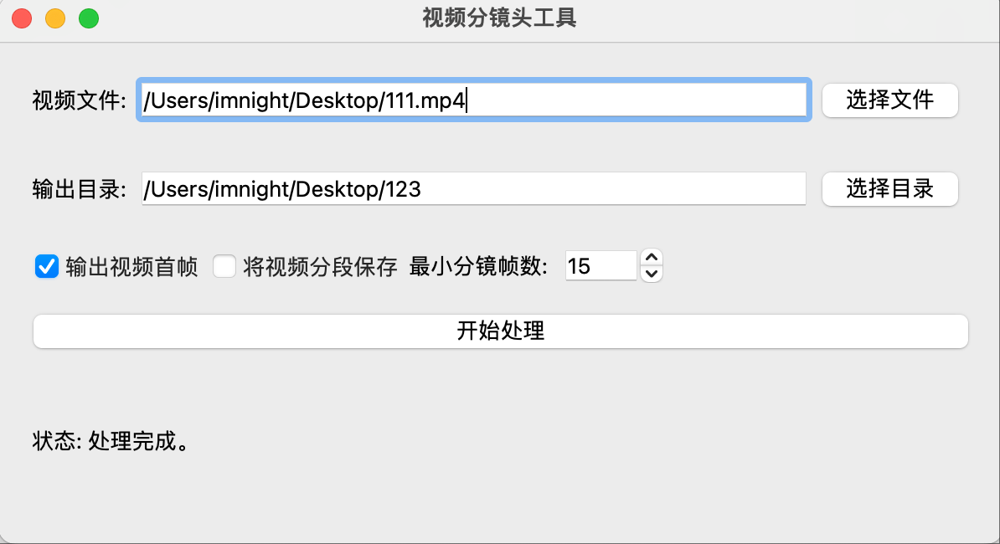

# 视频分镜头工具

这是一个基于 PyQt5 的图形界面工具，用于自动化视频分镜头、保存视频片段和提取关键帧。

## 功能特性

*   **直观的图形界面**：用户友好的界面，支持中文显示。
*   **视频文件选择**：轻松选择要处理的视频文件。
*   **输出目录选择**：指定处理结果的保存位置，默认打开桌面目录。
*   **视频分镜头**：自动检测视频中的场景变化，并将视频拆分为多个独立镜头。
*   **输出视频首帧**：可选择为每个检测到的分镜头保存其第一帧图像。
*   **分段保存视频**：可选择将每个分镜头保存为单独的视频文件。
*   **参数控制**：通过界面调整 `scenedetect` 的关键参数，例如“最小分镜帧数”。
*   **实时进度显示**：在视频处理过程中提供实时的进度反馈。
*   **预览功能**：处理完成后，显示第一个分镜的首帧图像作为预览。

## 软件截图



## 如何运行

1.  **克隆仓库** (如果尚未克隆):
    ```bash
    git clone https://github.com/your-repo/VideoClipSplit.git
    cd VideoClipSplit
    ```

2.  **安装依赖**：
    确保您已安装 `uv` 包管理器。然后运行以下命令安装所有必要的 Python 库：
    ```bash
    uv sync
    ```
    这将安装 `PyQt5`, `opencv-python`, `opencv-python-headless`, `scenedetect` 等依赖。

3.  **运行应用程序**：
    ```bash
    python main.py
    ```

## 使用说明

1.  **选择视频文件**：点击“选择文件”按钮，选择您要处理的视频文件。
2.  **选择输出目录**：点击“选择目录”按钮，选择保存处理结果的文件夹。默认会打开桌面。
3.  **配置选项**：
    *   勾选“输出视频首帧”以保存每个分镜的第一帧图像。
    *   勾选“将视频分段保存”以将每个分镜保存为单独的视频文件。
    *   调整“最小分镜帧数”来控制每个分镜的最小持续时间（以帧为单位）。
4.  **开始处理**：点击“开始处理”按钮，应用程序将开始分析视频并执行分镜头操作。
5.  **查看结果**：处理完成后，您将在输出目录中找到生成的视频片段、首帧图像和场景列表文件。界面上也会显示第一个分镜的预览图。

## 打包应用程序

您可以使用 PyInstaller 将应用程序打包成独立的可执行文件。

### Windows

创建一个名为 `build_windows.bat` 的文件，内容如下：

```bat
@echo off
uv run pyinstaller --noconfirm --onedir --windowed --name "视频分镜工具" --icon "assrt/ico.ico" --add-data "assrt;assrt" main.py
pause
```

### macOS

创建一个名为 `build_mac.sh` 的文件，内容如下：

```bash
#!/bin/bash
uv run pyinstaller --noconfirm --onedir --windowed --name "视频分镜工具" --icon "assrt/ico.ico" --add-data "assrt:assrt" main.py
```

**注意**：
*   在运行打包脚本之前，请确保您已安装 `pyinstaller` (`uv add pyinstaller`)。
*   `--name "视频分镜工具"` 用于设置打包后应��程序的名称。
*   `--icon "assrt/ico.ico"` 用于设置应用程序的图标。请确保 `assrt/ico.ico` 文件存在。
*   `--add-data "assrt;assrt"` (Windows) 和 `--add-data "assrt:assrt"` (macOS) 用于将 `assrt` 文件夹及其内容（包括 `pic.png` 和 `ico.ico`）包含在打包后的应用程序中。
* 打包完成后，可执行文件将在 `dist` 目录中。